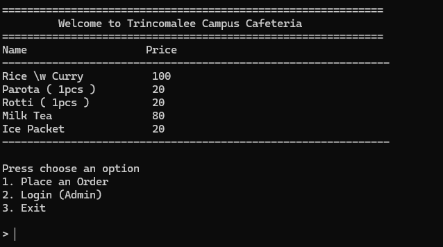

# Cafeteria-System

A C++ and SQL-based cafeteria management system built as a learning project to strengthen my C++ skills and practice database integration.
Started Learning C++ in September 2025.

Username : `admin` / `manager`
Password : `password`



### TO DO
- Menu System 
   - View available food items. [ DONE ]
   - Add new items (admin mode) [ PENDING ].

- Order System

  - Place order (choose item, qty). [ DONE ]
  - Store in DB (ORDERS table). [ DONE ]
  - Calculate total bill. [ DONE ]

- Reports (Admin Panel)

  - Show all orders of the day. [ MAYBE :) ]
  - Find most popular item. [ DONE ]
  - Show total sales. [ DONE ]
- Login (Admins only) [ DONE ]
  - More secure password encryption [ PENDING ] 
  - User Management [ PENDING ]
  
- Web UI
  - Design REST API backend in C++ (Crow) [ DONE ]
  - Connect SQLite database to backend for live data retrieval and updates [ DONE ]
  - Develop Web UI (frontend) [ DONE ]
  - Admin Dashboard [ PENDING ]

How to Complie : `g++ .\main.cpp -lsqlite3 -lssl -lcrypto -o .\Cafeteria.exe`

# Web API (Not Smooth)

Please clone below repos
    - `https://github.com/chriskohlhoff/asio.git`
    - `https://github.com/CrowCpp/Crow.git`

How to complie : `g++ -std=c++17 main.cpp -o API -I Crow/include -lsqlite3 -I asio/include -lws2_32 -lmswsock`

Please note that your folder path needs to arranged as below
```bash
/WEBAPI/   
    -- Crow/
    -- asio/
    -- templates/
    -- main.cpp
```


<!--
  
  DB Structure 
    - Menu items
    - Users
    - Orders
  
  >